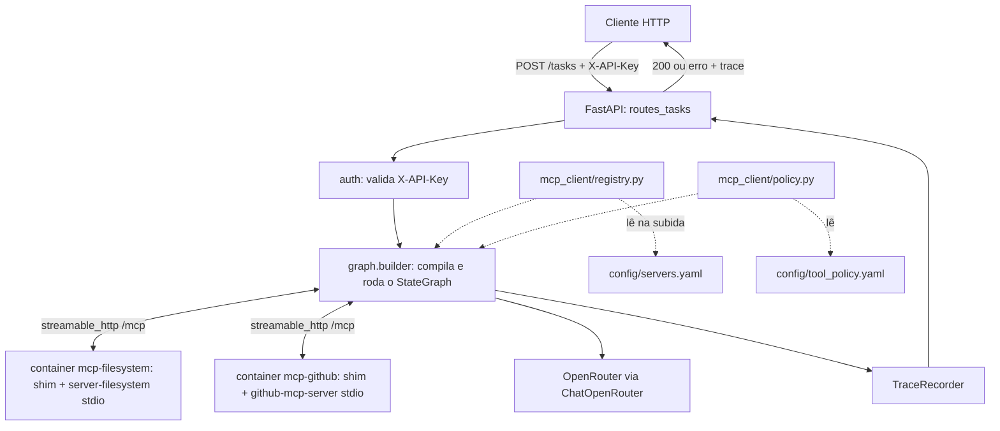

# Agente Orquestrador de MCP Servers Design

**Spec**: `.specs/features/mcp-orchestrator/spec.md`
**Status**: Draft

> Nenhum gate determinístico de fase existe para Design nesta skill (`tlc-spec-driven` só
> traz `validate_spec.py`, `validate_tasks.py`, `check_commit.py`, `validate_state.py`). A
> verificação desta fase é (1) `validate_spec.py` sobre a emenda de contrato feita aqui e
> (2) o checklist manual da seção **Verificação desta fase**, ao final deste documento.

---

## Architecture Overview

O gateway é um serviço FastAPI stateless por request. Cada `POST /tasks` monta um
`OrchestratorState` novo, compila e executa um grafo LangGraph (`StateGraph` customizado,
não um agente prebuilt — ver **Tech Decisions** / AD-002) que implementa um loop ReAct
limitado a `MAX_REACT_ITERATIONS`. As tools do grafo vêm de um `MultiServerMCPClient`
(`langchain-mcp-adapters`) conectado, via **Streamable HTTP**, a um container por MCP
server. Cada container de MCP server executa o binário oficial (stdio) atrás de um shim
FastMCP que traduz stdio↔Streamable HTTP (ver §2 — Transporte MCP).



---

## 1. Arquitetura do grafo LangGraph

### 1.1 Por que `StateGraph` customizado (não prebuilt)

Um agente ReAct pronto (`create_agent`/`create_react_agent`) esconde exatamente o que os
requisitos exigem controlar explicitamente:

| Requisito | Por que o prebuilt não basta |
| --- | --- |
| MCPO-03 (loop limitado, `finish_reason` de 3 valores) | O prebuilt não expõe um terceiro estado terminal distinto de "parou" — `max_iterations_reached` vs `completed` vs `no_suitable_server` exige uma aresta condicional própria lendo o contador |
| MCPO-04 (trace por passo: server, tool, argumentos, duração, tentativa, status) | O prebuilt não grava metadados de execução por chamada no formato do contrato — precisamos de um `tool_node` próprio que instrumenta cada chamada |
| MCPO-08 (bloqueio de tool de escrita **antes** da execução) | Bloquear precisa acontecer entre a decisão do LLM e a chamada real — um nó `guard` dedicado antes do `tools`, que o prebuilt não separa |

### 1.2 Diagrama de nós e arestas

```
        START
          │
          ▼
      ┌─────────┐
      │ prepare │  monta system prompt + catálogo de tools do registry;
      └────┬────┘  semeia messages com a task recebida
           ▼
      ┌─────────┐◀────────────────┐
      │  agent  │ LLM decide      │
      └────┬────┘ (bind_tools)    │
           │                      │
           ▼ route_after_agent    │
    ┌──────┴───────┬──────────┐   │
    │              │          │   │
tool_calls    tool_calls   sem tool_calls
& iter<MAX    & iter>=MAX  ┌──┴──────────────┐
    │              │       │                 │
    ▼              │   used_tools==[]   used_tools!=[]
┌─────────┐         │       │                 │
│  guard  │         │       ▼                 ▼
└────┬────┘         │  finish_reason=    finish_reason=
allow│ │deny        │  no_suitable_      completed
     │ └──────┐     │  server            │
     ▼        │     │       │            │
┌─────────┐   │     │       ▼            ▼
│  tools  │   │     │   ┌──────────────────┐
└────┬────┘   │     │   │     finalize     │
     │        └─────┼──▶│ compõe result +  │
     │              │   │ trace completo   │
     └──────────────┘   └────────┬─────────┘
   (volta para agent,            ▼
    iterations += 1)            END
```

- `route_after_agent` (aresta condicional a partir de `agent`) é a **única** fonte dos 3
  estados terminais de sucesso — nenhum outro ponto do grafo escreve `finish_reason`.
- `guard` → `deny` também alimenta `finalize`, mas por um caminho de **erro**
  (`TOOL_NOT_ALLOWED`, HTTP 403), coberto em Error Handling Strategy, não pela tabela acima.

### 1.3 Tabela de nós

| Nó | Responsabilidade | Requisitos |
| --- | --- | --- |
| `prepare` | Lê o catálogo de tools do `registry` (nome do server, nome da tool, descrição, `write: bool`), monta o system prompt, inicializa `messages` com a `task` do request | MCPO-01, MCPO-02 |
| `agent` | `llm.bind_tools(tools).ainvoke(messages)`; qualquer exceção de rede/HTTP do provider é recapturada como `LLM_PROVIDER_ERROR` | MCPO-01, MCPO-05 |
| `guard` | Para cada `tool_call` pendente, consulta `policy.is_allowed(server, tool)`. Se alguma tool de escrita não está na allowlist: grava step com `status: "blocked"`, define erro `TOOL_NOT_ALLOWED`, desvia para `finalize` **sem executar nenhuma tool da leva** | MCPO-08 |
| `tools` | Executa cada `tool_call` via `MultiServerMCPClient`, com timeout `MCP_TOOL_TIMEOUT_S` e 1 retry automático só em erro de transporte/timeout (nunca em erro de negócio); grava `steps[]` (server, tool, arguments, duration_ms, attempt, status); adiciona ao `used_tools`; incrementa `iterations` | MCPO-03, MCPO-04, MCPO-05 |
| `finalize` | Único nó que escreve `finish_reason` e `result` finais; se `error` está setado no estado, monta o envelope de erro em vez do envelope de sucesso | MCPO-01, MCPO-03, MCPO-09 |

### 1.4 Condições de transição (`route_after_agent`)

| Condição | Destino | `finish_reason` | HTTP |
| --- | --- | --- | --- |
| `last_message.tool_calls` não vazio e `iterations < MAX_REACT_ITERATIONS` | `guard` | (ainda não definido) | — |
| `last_message.tool_calls` não vazio e `iterations >= MAX_REACT_ITERATIONS` | `finalize` | `max_iterations_reached` | 200 |
| `tool_calls` vazio e `used_tools == []` | `finalize` | `no_suitable_server` | 200 |
| `tool_calls` vazio e `used_tools != []` | `finalize` | `completed` | 200 |

### 1.5 Terminação garantida (MCPO-03 AC4)

Dois mecanismos independentes, redundantes por design:

1. **Lógica de negócio**: `route_after_agent` compara `iterations` contra
   `MAX_REACT_ITERATIONS` antes de decidir voltar a `guard`/`tools`.
2. **Rede de segurança do runtime**: o grafo é compilado com
   `graph.compile()` e invocado com um `recursion_limit` (via `RunnableConfig`) coerente
   com `MAX_REACT_ITERATIONS` × passos internos por iteração. Se a lógica de negócio
   falhar por um bug futuro, o LangGraph aborta com `GraphRecursionError` antes de rodar
   indefinidamente — capturado pela camada da API e mapeado para `INTERNAL_ERROR` (nunca
   deveria disparar em operação normal; é defesa em profundidade, não o mecanismo primário).

O timeout **global** do request (`REQUEST_TIMEOUT_S`) não é uma aresta do grafo — vive na
camada da API, envolvendo a iteração sobre `graph.astream(..., stream_mode="values")` com
`asyncio.timeout(...)` (não `graph.ainvoke(...)`: cancelar um `ainvoke()` não devolve nenhum
estado parcial, então só `astream` permite guardar o último snapshot de estado emitido antes
do cancelamento — ver AD-009, `STATE.md`). Ao estourar, a API monta o erro `REQUEST_TIMEOUT`
(504) usando o `trace` parcial acumulado até o ponto do cancelamento (steps já executados
continuam no trace).

### 1.6 Estado do grafo

```python
class OrchestratorState(TypedDict):
    task: str
    request_id: str
    messages: Annotated[list[AnyMessage], add_messages]
    iterations: int
    steps: list[TraceStep]
    used_tools: list[str]
    finish_reason: str | None       # None enquanto o grafo roda; setado só em finalize
    error: ErrorInfo | None         # {"code": str, "message": str} ou None
    started_at: float               # time.monotonic(), para duration_ms
```

---

## 2. Transporte MCP — recomendação justificada

### Recomendação

**Streamable HTTP entre o gateway e os MCP servers.** stdio fica confinado *dentro* de
cada container de server, atrás de um shim que traduz stdio↔Streamable HTTP. SSE (e
HTTP+SSE legado) não é usado em nenhum ponto do sistema.

### Evidência verificada (Context7 + docs oficiais, não memória de treino)

| Fato | Fonte |
| --- | --- |
| A spec MCP na revisão **2025-11-25** define exatamente dois transportes padrão: **stdio** e **Streamable HTTP**. HTTP+SSE está listado como transporte **deprecado**, mantido só por retrocompatibilidade (fallback de cliente) | `modelcontextprotocol.io/specification/2025-11-25/basic/transports` |
| `@modelcontextprotocol/server-filesystem` (imagem oficial `mcp/filesystem`) é **stdio-only**; não expõe flag de porta ou HTTP. Diretórios permitidos são passados como **argumentos posicionais** do processo, montados sob `/projects` | README oficial do server filesystem, `modelcontextprotocol/servers` |
| `ghcr.io/github/github-mcp-server` roda via subcomando `stdio` (`docker run -i ... github-mcp-server stdio`), também **stdio-only** localmente. O único transporte HTTP oficial do GitHub é o server **remoto e hospedado** em `https://api.githubcopilot.com/mcp/` — fora do nosso controle de infraestrutura | README oficial `github/github-mcp-server` |
| `fastmcp` (pacote `prefecthq/fastmcp`, v3) expõe `create_proxy(target)` aceitando um `ClientTransport` (incluindo `StdioTransport`) e `proxy.run(transport="http", host, port)`, servindo por padrão em `streamable_http_path = "/mcp"`. Cada request do proxy recebe uma **sessão de backend isolada** (documentado como comportamento padrão, não opt-in) | `docs/servers/providers/proxy.mdx`, `fastmcp/mcp_config.py` (Context7) |
| `langchain-mcp-adapters` (`MultiServerMCPClient`) suporta `{"transport": "streamable_http", "url": ..., "timeout": ...}` como configuração de primeira classe, ao lado de `"stdio"` | `_autodocs/` do repo `langchain-ai/langchain-mcp-adapters` (Context7) |

### Por que não as alternativas

| Alternativa | Por que descartada |
| --- | --- |
| Rodar cada server como subprocesso stdio **dentro do container do gateway** | Viola MCPO-07 AC1 ("containers dos MCP servers filesystem e github", plural, separados) por construção — stdio pressupõe que o cliente seja dono do ciclo de vida do processo filho, não um container irmão. Também mistura runtimes (Node do server-filesystem + Go do github-mcp-server + Python do gateway) numa imagem só, e torna "server unhealthy" um estado interno do processo Python em vez de um container que pode cair/reiniciar independentemente (quebra MCPO-02 AC2 na prática, mesmo que não na letra) |
| Usar o GitHub remoto (`api.githubcopilot.com/mcp/`) via Streamable HTTP nativo, evitando shim só nesse server | Resolveria só metade do problema (filesystem continua stdio-only) e torna o smoke test E2E (MCPO-07 AC3) dependente de rede externa e de um PAT com escopo válido em tempo de CI — o compose deixa de ser autocontido |
| SSE / HTTP+SSE | Deprecado na própria spec MCP referenciada acima; não introduzir um transporte que a spec do protocolo já descontinuou |

### Por que HTTP no fio resolve o requisito de erro mais fino (MCPO-05)

Com Streamable HTTP entre gateway e servers, uma falha de `httpx`/conexão TCP recusada é
distinguível, por tipo de exceção, de uma resposta HTTP que apenas demorou. Isso é o que
permite ao gateway mapear:

- conexão recusada / DNS falha / socket fechado → `MCP_SERVER_UNAVAILABLE` (502)
- resposta que excede `MCP_TOOL_TIMEOUT_S` → `MCP_TOOL_TIMEOUT` (504), após 1 retry

Com subprocesso stdio interno ao gateway, ambas as falhas colapsariam em erro de pipe
quebrado/timeout de leitura do mesmo tipo, exigindo heurísticas frágeis para separar os
dois códigos de erro do catálogo.

### Shim: `create_proxy` (FastMCP), idêntico para todo server

```python
# shim/mcp_http_shim.py
import os
import shlex

from fastmcp.client.transports import StdioTransport
from fastmcp.server import create_proxy

proxy = create_proxy(
    StdioTransport(
        command=os.environ["MCP_STDIO_COMMAND"],
        args=shlex.split(os.environ.get("MCP_STDIO_ARGS", "")),
        env=dict(os.environ),
    ),
    name=os.environ["MCP_SERVER_NAME"],
)

proxy.run(
    transport="http",
    host="0.0.0.0",
    port=int(os.environ.get("PORT", "8000")),
)
```

**Decisão deliberada:** passar um `StdioTransport` diretamente a `create_proxy`, em vez de
um dict `MCPConfig` com `mcpServers`. A rota `MCPConfig` monta o proxy composto sob um
*namespace* (mecanismo de `mcp.mount(..., namespace=...)`) e prefixaria os nomes das
tools automaticamente — o gateway já prefixa com o nome do server via `TraceRecorder`
(§3), e um prefixo duplicado vindo do shim quebraria silenciosamente o parsing de
`used_tools`.

Um único shim (`mcp_http_shim.py`) serve os dois servers; o que muda por container é só o
env (`MCP_STDIO_COMMAND`, `MCP_STDIO_ARGS`, `MCP_SERVER_NAME`) — ver §4.

---

## 3. Estrutura de pacotes

```
agent-orchestrator-mcp/
├─ pyproject.toml
├─ docker-compose.yml
├─ .env.example
├─ Dockerfile                          # gateway
├─ config/
│  ├─ servers.yaml                     # nome, transport, url, timeout, enabled
│  └─ tool_policy.yaml                 # classificação write/read + allowlist (MCPO-08)
├─ docker/
│  ├─ shim-base/Dockerfile             # python:3.13-slim + fastmcp + shim/
│  ├─ filesystem/Dockerfile            # FROM shim-base + Node LTS + server-filesystem (pin)
│  └─ github/Dockerfile                # FROM shim-base + binário github-mcp-server
├─ shim/
│  └─ mcp_http_shim.py
├─ scripts/
│  └─ smoke_test.py                    # E2E pós-`docker compose up` (MCPO-07 AC3)
├─ src/orchestrator/
│  ├─ main.py                          # app factory + lifespan (discovery na subida)
│  ├─ settings.py                      # pydantic-settings; todos os envs da spec
│  ├─ api/
│  │  ├─ routes_tasks.py               # POST /tasks
│  │  ├─ routes_servers.py             # GET /servers
│  │  ├─ routes_health.py              # GET /health (P3, MCPO-11)
│  │  ├─ schemas.py                    # pydantic: TaskRequest, TaskResponse, ErrorResponse, Trace
│  │  ├─ auth.py                       # dependency: valida X-API-Key
│  │  └─ errors.py                     # exception handlers → catálogo de 8 códigos
│  ├─ mcp_client/
│  │  ├─ registry.py                   # lê servers.yaml, inicializa MultiServerMCPClient, healthcheck
│  │  ├─ policy.py                     # lê tool_policy.yaml, is_allowed(server, tool)
│  │  └─ exceptions.py                 # ServerUnavailableError, ToolTimeoutError, ToolNotAllowedError
│  ├─ graph/
│  │  ├─ state.py                      # OrchestratorState, TraceStep, ErrorInfo
│  │  ├─ nodes.py                      # prepare, agent, guard, tools, finalize
│  │  ├─ builder.py                    # monta o StateGraph, compile(), recursion_limit
│  │  └─ prompts.py                    # system prompt com o catálogo de tools
│  ├─ llm/
│  │  └─ provider.py                   # ChatOpenRouter + mapeamento de exceção → LLM_PROVIDER_ERROR
│  └─ observability/
│     ├─ logging.py                    # logs estruturados JSON com request_id
│     └─ trace.py                      # TraceRecorder: monta trace.steps/used_tools/duration_ms
└─ tests/
   ├─ unit/
   ├─ integration/
   ├─ eval/
   │  ├─ dataset.json                  # 15 casos rotulados (MCPO-10)
   │  └─ fixtures/                     # respostas do LLM gravadas, por caso
   └─ e2e/
```

### Decisões de nomenclatura e fronteiras

- **`mcp_client/` e não `mcp/`** — evita colisão visual/import com o pacote PyPI `mcp`
  (SDK oficial, dependência transitiva via `langchain-mcp-adapters`).
- **`registry.py` é o único ponto que lê `config/servers.yaml`.** Nenhum nome de server ou
  de tool aparece hardcoded em `graph/` — é a base de MCPO-02 AC4 ("nenhuma tool ou server
  usado pelo grafo pode vir de código hardcoded") e do Success Criterion "adicionar um
  terceiro server (`fetch`) não exige alterar arquivo do pacote do grafo". `graph/nodes.py`
  recebe a lista de tools já resolvida como parâmetro/dependência, nunca importa `registry`
  para nomes específicos.
- **`used_tools` é composto pelo `TraceRecorder`** como `f"{server_name}.{tool_name}"`, a
  partir do `server_name` que o `registry` já conhece (não do prefixo que
  `tool_name_prefix=True` do adapter geraria) — o formato do separador do adapter não é
  contrato nosso e pode mudar entre versões da lib.
- **AD-005** (`STATE.md`) formaliza essa fronteira como decisão de projeto, não só desta
  feature.

---

## Code Reuse Analysis

Projeto greenfield — não há código interno anterior. A tabela abaixo lista o que é
**reusado de terceiros em vez de escrito à mão**, o que evita reimplementar transporte
MCP, pool de sessão e parsing de tool-calling.

### Existing Components to Leverage

| Componente | Origem | Como é usado |
| --- | --- | --- |
| `MultiServerMCPClient` | `langchain-mcp-adapters` | Pool de conexões Streamable HTTP a cada server configurado; traduz tools MCP para `BaseTool` do LangChain via `get_tools()` |
| `tool_interceptors` | `langchain-mcp-adapters` | Ponto de enganche natural para instrumentação de timing/retry por chamada (ver `graph/nodes.py::tools`), sem precisar monkeypatch no client |
| `create_proxy` + `StdioTransport` | `fastmcp` | O shim inteiro do transporte (§2) — nenhum código de tradução de protocolo é escrito à mão |
| `ChatOpenRouter` | `langchain-openrouter` | Cliente de chat compatível com `bind_tools`, preservando campos específicos do OpenRouter (ver Tech Decisions) |
| `StateGraph`, `add_messages`, `ToolNode` (padrão de referência, não usado literalmente) | `langgraph` | Base do grafo customizado — reusa o reducer `add_messages` para o histórico, não reusa `ToolNode` pronto (ver §1.1: `tools` é um nó customizado por causa do trace) |

### Integration Points

| Sistema | Método de integração |
| --- | --- |
| OpenRouter | `ChatOpenRouter(api_key=OPENROUTER_API_KEY, model=OPENROUTER_MODEL)`, chamado só a partir do nó `agent` |
| MCP servers (containers) | `MultiServerMCPClient` configurado a partir de `config/servers.yaml`, resolvido por `registry.py` no lifespan do FastAPI |
| Docker healthcheck | TCP na porta do shim; saúde funcional real (`initialize`+`tools/list`) é responsabilidade do `registry.py`, não do compose |

---

## Components

### `mcp_client.registry`

- **Purpose**: Ler `config/servers.yaml`, inicializar o `MultiServerMCPClient`, expor
  status (`healthy`/`unhealthy`) e catálogo de tools por server.
- **Location**: `src/orchestrator/mcp_client/registry.py`
- **Interfaces**:
  - `async def discover() -> None` — conecta a cada server declarado; falha isolada por
    server não aborta a subida (MCPO-02 AC2)
  - `def servers() -> list[ServerInfo]` — para `GET /servers`
  - `async def get_tools() -> list[BaseTool]` — para o nó `prepare`
- **Dependencies**: `MultiServerMCPClient`, `config/servers.yaml`
- **Reuses**: `MultiServerMCPClient.get_tools(server_name=...)`

### `mcp_client.policy`

- **Purpose**: Classificar cada tool como leitura/escrita e decidir se uma tool de escrita
  está na allowlist.
- **Location**: `src/orchestrator/mcp_client/policy.py`
- **Interfaces**:
  - `def is_allowed(server: str, tool: str) -> bool`
  - `def is_write(server: str, tool: str) -> bool`
- **Dependencies**: `config/tool_policy.yaml`
- **Reuses**: nada externo — regra de negócio pura, testável sem I/O

### `graph.builder`

- **Purpose**: Montar e compilar o `StateGraph` (§1).
- **Location**: `src/orchestrator/graph/builder.py`
- **Interfaces**:
  - `def build_graph(tools: list[BaseTool], policy: Policy) -> CompiledGraph`
- **Dependencies**: `graph.nodes`, `graph.state`, `langgraph.graph.StateGraph`
- **Reuses**: `add_messages` reducer do LangGraph

### `graph.nodes`

- **Purpose**: Implementar `prepare`, `agent`, `guard`, `tools`, `finalize` e
  `route_after_agent`.
- **Location**: `src/orchestrator/graph/nodes.py`
- **Interfaces**: uma função por nó, assinatura `async def node(state: OrchestratorState) -> dict`
- **Dependencies**: `llm.provider`, `mcp_client.policy`, `observability.trace`
- **Reuses**: exceções de `mcp_client.exceptions` para mapear falhas de tool

### `observability.trace`

- **Purpose**: Acumular `steps`, `used_tools`, `duration_ms` e montar o `trace` final no
  formato exato do contrato.
- **Location**: `src/orchestrator/observability/trace.py`
- **Interfaces**:
  - `class TraceRecorder`
  - `def record_step(server, tool, arguments, duration_ms, attempt, status) -> None`
  - `def to_dict(finish_reason: str) -> dict`
- **Dependencies**: nenhuma externa
- **Reuses**: nada — é o componente que garante o contrato de MCPO-04

### `llm.provider`

- **Purpose**: Encapsular `ChatOpenRouter` e mapear qualquer erro do provider para
  `LLM_PROVIDER_ERROR`.
- **Location**: `src/orchestrator/llm/provider.py`
- **Interfaces**:
  - `def get_chat_model() -> ChatOpenRouter`
- **Dependencies**: `langchain-openrouter`
- **Reuses**: `ChatOpenRouter` (ver Tech Decisions)

---

## Data Models

### `OrchestratorState` (grafo, `TypedDict`)

```python
class TraceStep(TypedDict):
    step: int
    server: str
    tool: str
    arguments: dict
    duration_ms: int
    attempt: int
    status: Literal["success", "failure", "blocked"]

class ErrorInfo(TypedDict):
    code: str      # um dos 8 códigos do catálogo da spec
    message: str

class OrchestratorState(TypedDict):
    task: str
    request_id: str
    messages: Annotated[list[AnyMessage], add_messages]
    iterations: int
    steps: list[TraceStep]
    used_tools: list[str]
    finish_reason: Literal["completed", "no_suitable_server", "max_iterations_reached", "error"] | None
    error: ErrorInfo | None
    started_at: float
```

**Relacionamentos**: `TraceStep` é o item de `steps`; `ErrorInfo` só é não-nulo quando
`finish_reason == "error"`. `TraceRecorder.to_dict()` projeta `OrchestratorState` para o
JSON exato do contrato (`request_id`, `iterations`, `steps`, `used_tools`, `finish_reason`,
`duration_ms`).

### `ServerInfo` (API, resposta de `GET /servers`)

```python
class ToolInfo(TypedDict):
    name: str
    description: str
    write: bool

class ServerInfo(TypedDict):
    name: str
    status: Literal["healthy", "unhealthy"]
    tools: list[ToolInfo]
```

**Relacionamentos**: produzido por `mcp_client.registry.servers()`, consumido só pela
rota `GET /servers` — não entra no grafo.

---

## Error Handling Strategy

| Código (`error.code`) | HTTP | Origem detectada em | `trace.finish_reason` |
| --- | --- | --- | --- |
| `UNAUTHORIZED` | 401 | `api.auth` — header ausente ou não bate com `ORCHESTRATOR_API_KEY` | `error` |
| `INVALID_TASK` | 422 | `api.schemas` — validação pydantic de `task` (vazio/ausente/>4000/JSON inválido) | `error` |
| `MCP_SERVER_UNAVAILABLE` | 502 | `graph.nodes.tools` — exceção de conexão do `MultiServerMCPClient` (recusada/DNS/socket) | `error` |
| `MCP_TOOL_TIMEOUT` | 504 | `graph.nodes.tools` — timeout após 1 retry de transporte | `error` |
| `TOOL_NOT_ALLOWED` | 403 | `graph.nodes.guard` — tool de escrita fora de `tool_policy.yaml` | `error` |
| `LLM_PROVIDER_ERROR` | 502 | `llm.provider` / `graph.nodes.agent` — erro/indisponibilidade do OpenRouter | `error` |
| `REQUEST_TIMEOUT` | 504 | `api.routes_tasks` — `asyncio.timeout` em torno da iteração sobre `graph.astream` estourou | `error` |
| `INTERNAL_ERROR` | 500 | `api.errors` — handler global; qualquer exceção não classificada acima, incluindo `GraphRecursionError` inesperado | `error` |

Regra fixa (MCPO-05 AC6): o handler global do FastAPI captura **toda** exceção não
mapeada e responde com `INTERNAL_ERROR` — nunca um 500 sem `error.code` do catálogo.
Em todos os 8 casos, o `trace` (mesmo parcial) acompanha a resposta, conforme MCPO-04 AC1.

---

## Risks & Concerns

| Concern | Location | Impact | Mitigation |
| --- | --- | --- | --- |
| **Resolvido em T1 (Fase 5).** Caminho confirmado: `/server/github-mcp-server`, tag pinada `v1.11.0` — igual à suposição original do Dockerfile, verificado via `docker inspect` (Entrypoint) + extração do binário (`docker create`/`docker cp`, ELF64 Go estático). Achado novo: a imagem é distroless/scratch (sem `sh`/`ls`/`busybox`) — o comando de discovery de `tasks.md` baseado em shell não roda contra ela (exit 127), método alternativo documentado em §4 | `docker/github/Dockerfile` | Nenhum para T30 (o `COPY --from=bin` do multi-stage não precisa de shell na imagem de origem); risco residual só se um dia se precisar rodar um comando interativo/healthcheck de shell *dentro* do container `github` final — o shim (Python) já não depende disso | Fallback de build a partir do código-fonte (`go build -o github-mcp-server ./cmd/github-mcp-server`) permanece documentado como plano B caso uma tag futura mova o binário de lugar; não foi necessário nesta checagem |
| Fixtures de avaliação (modo CI) podem ficar estagnadas: são gravadas uma vez e não refletem mudanças no prompt de decisão | `tests/eval/fixtures/` | Acurácia reportada em CI deixa de refletir o comportamento real do LLM assim que `graph/prompts.py` muda, mascarando regressão | AD-004 (`STATE.md`): regravar as fixtures na mesma task/commit que altera `prompts.py`; isso deve virar item explícito de checklist na Fase 4 |
| Latência e custo do loop ReAct: até `MAX_REACT_ITERATIONS` (5) chamadas ao LLM em série, cada uma podendo levar segundos, somadas ao `MCP_TOOL_TIMEOUT_S` (30s) por chamada de tool | `graph/builder.py`, `REQUEST_TIMEOUT_S=120s` | Tarefas multi-step no limite de iterações podem se aproximar do teto global e retornar `REQUEST_TIMEOUT` mesmo progredindo normalmente | `REQUEST_TIMEOUT_S` já é configurável por env; documentar no `design.md`/README a relação aproximada `MAX_REACT_ITERATIONS × (tempo_llm + MCP_TOOL_TIMEOUT_S) < REQUEST_TIMEOUT_S` para quem for ajustar os defaults |
| `GITHUB_READ_ONLY=1` como default seguro interage com `tool_policy.yaml`: se o server já bloqueia escrita nativamente, uma tool de escrita "permitida" na allowlist ainda falhará no server, gerando um erro de negócio diferente do esperado pelo operador | `docker/github/Dockerfile`, `config/tool_policy.yaml` | Confusão operacional ao tentar habilitar escrita no GitHub sem desligar `GITHUB_READ_ONLY` | Documentar explicitamente no `.env.example` que `GITHUB_READ_ONLY` e a allowlist são dois portões independentes — ambos precisam permitir a operação |
| A spec MCP exige validação do header `Origin` pelo servidor Streamable HTTP (proteção contra DNS rebinding), mesmo em rede interna do compose | `shim/mcp_http_shim.py` | Sem essa validação, o shim aceita conexões de qualquer `Origin` — risco baixo (rede interna, sem exposição de porta ao host) mas é um desvio da spec do protocolo | Registrar como item de hardening na Fase 4; não bloqueia o MVP porque a porta do shim não é publicada ao host (`docker-compose.yml`, sem `ports:` nos servers) |

---

## Tech Decisions

| Decisão | Escolha | Rationale |
| --- | --- | --- |
| Transporte MCP no fio | Streamable HTTP (servers oficiais stdio atrás de shim por container) | §2 — única forma de manter "container por server" com servers oficiais stdio-only, e a única que discrimina `MCP_SERVER_UNAVAILABLE` de `MCP_TOOL_TIMEOUT` |
| Shim stdio↔HTTP | `fastmcp.server.create_proxy` + `StdioTransport`, não `supergateway` (Node) nem `mcp-proxy` (SSE only, sem Streamable HTTP para stdio local) | Um único runtime (Python) no projeto inteiro; assinatura confirmada em doc oficial, não suposta; `mcp-proxy` foi descartado por só suportar SSE na direção stdio→rede, que está deprecado |
| Orquestração do grafo | `StateGraph` customizado, não agente prebuilt | §1.1 — controle de trace por passo, terceiro estado terminal e bloqueio pré-execução |
| Cliente LLM | `langchain-openrouter` (`ChatOpenRouter`), não `ChatOpenAI(base_url=...)` | Pacote dedicado existe e é recomendado pela doc oficial do LangChain para providers que não são a OpenAI stricto sensu; evita perda de campos específicos do OpenRouter (`reasoning`, etc.) |
| Composição de `used_tools` | `f"{server}.{tool}"`, montado pelo `TraceRecorder` a partir do `server_name` do registry | Não depender do formato de prefixo que `tool_name_prefix=True` do adapter geraria — não é contrato nosso |
| Avaliação de roteamento | Dois modos: fixtures gravadas (gate de CI) + modo live opt-in (`EVAL_LIVE=1`) | AD-004 — determinismo em CI (MCPO-10 AC2) sem abrir mão de medir acurácia real quando necessário |

> **Decisões de projeto** correspondentes (AD-001 a AD-005) foram registradas em
> `.specs/STATE.md` → `## Decisions`, pois constrangem fases futuras, não só esta.

---

## 4. Estrutura de pacotes — detalhe do Dockerfile por server

```dockerfile
# docker/shim-base/Dockerfile
FROM python:3.13-slim
RUN pip install --no-cache-dir fastmcp
COPY shim/mcp_http_shim.py /app/mcp_http_shim.py
WORKDIR /app
CMD ["python", "mcp_http_shim.py"]
```

```dockerfile
# docker/filesystem/Dockerfile
FROM shim-base:latest
RUN apt-get update && apt-get install -y --no-install-recommends nodejs npm \
    && npm install -g @modelcontextprotocol/server-filesystem@<pin> \
    && apt-get purge -y npm && rm -rf /var/lib/apt/lists/*
ENV MCP_SERVER_NAME=filesystem
ENV MCP_STDIO_COMMAND=mcp-server-filesystem
ENV MCP_STDIO_ARGS=/projects
```

```dockerfile
# docker/github/Dockerfile
FROM ghcr.io/github/github-mcp-server:v1.11.0 AS bin
FROM shim-base:latest
COPY --from=bin /server/github-mcp-server /usr/local/bin/github-mcp-server
ENV MCP_SERVER_NAME=github
ENV MCP_STDIO_COMMAND=github-mcp-server
ENV MCP_STDIO_ARGS=stdio
```

> **Confirmado na Fase 5 / Execute (T1).** O caminho `/server/github-mcp-server` estava
> certo: `docker inspect ghcr.io/github/github-mcp-server:v1.11.0` mostra
> `Entrypoint: ["/server/github-mcp-server"]` e `WorkingDir: /server`; extrair o arquivo
> (`docker create` + `docker cp`) confirma um binário ELF64 Go estaticamente linkado nesse
> caminho exato. Tag pinada: **`v1.11.0`** (`org.opencontainers.image.version=1.11.0`,
> mesmo digest que `latest` no momento da checagem, 2026-08-30) — não é a tag `latest`
> nem um chute; foi resolvida consultando a API de tags do GHCR
> (`ghcr.io/v2/github/github-mcp-server/tags/list`) e cruzada com
> `api.github.com/repos/github/github-mcp-server/releases/latest`.
>
> **Achado adicional, fora da suposição original:** a imagem é distroless/scratch — sem
> `sh`, `ls` ou `busybox`. O comando de discovery prescrito em `tasks.md`
> (`--entrypoint sh ... -c 'command -v github-mcp-server'`) falha com exit 127 porque não
> há shell algum na imagem, não porque o binário esteja ausente ou em outro caminho. A
> confirmação acima (`docker inspect` + `docker create`/`docker cp` + verificação do tipo
> do arquivo) é o método que efetivamente funciona contra esta imagem e deve substituir o
> comando de shell em qualquer re-checagem futura. Isso não muda o `docker/github/Dockerfile`
> acima (o `COPY --from=bin` de um multi-stage build não depende de shell na imagem de
> origem), mas é relevante para T27 (o shim não pode assumir um healthcheck baseado em
> shell dentro do container `github`, caso um dia rode fora do padrão atual de TCP-only via
> Python) e já está refletido na tabela de Risks & Concerns abaixo.

---

## 5. Topologia do docker-compose

```yaml
# docker-compose.yml (esboço — a versão completa nasce na Fase 5/Execute)
services:
  gateway:
    build: .
    ports:
      - "8080:8000"
    env_file: .env
    depends_on:
      mcp-filesystem:
        condition: service_healthy
      mcp-github:
        condition: service_healthy
    networks: [mcpnet]

  mcp-filesystem:
    build: docker/filesystem
    volumes:
      - ./workspace:/projects
    healthcheck:
      test: ["CMD", "python", "-c", "import socket; socket.create_connection(('localhost', 8000), 2)"]
      interval: 5s
      timeout: 3s
      retries: 5
    networks: [mcpnet]
    # sem `ports:` — não exposto ao host

  mcp-github:
    build: docker/github
    env_file: .env
    healthcheck:
      test: ["CMD", "python", "-c", "import socket; socket.create_connection(('localhost', 8000), 2)"]
      interval: 5s
      timeout: 3s
      retries: 5
    networks: [mcpnet]
    # sem `ports:` — não exposto ao host

networks:
  mcpnet:
```

### Decisões de topologia

- **Única porta publicada ao host: a do `gateway` (8080→8000).** Os servers MCP não têm
  `ports:` — só alcançáveis pela rede interna `mcpnet`. É essa restrição de rede que
  sustenta a premissa da spec de que "autenticação OAuth do protocolo MCP é non-goal
  porque os servers rodam na rede interna do compose".
- **`healthcheck` do compose é só TCP** (o shim aceita conexão). A prova funcional real —
  `initialize` + `tools/list` bem-sucedidos — é feita pelo `mcp_client.registry.discover()`
  no `lifespan` do FastAPI, e é isso que alimenta `GET /servers` com `healthy`/`unhealthy`
  por server (MCPO-02 AC2/AC3). Consequência deliberada: o `gateway` usa
  `depends_on: condition: service_healthy` (espera o TCP subir) mas **não** trava a
  própria inicialização se um server ficar `unhealthy` na checagem funcional — ele sobe
  mesmo assim, marcando aquele server como `unhealthy`, conforme MCPO-02 AC2 exige
  textualmente.
- **Segredos só via `env_file: .env`**, nunca inline no compose — `.env` nunca é
  versionado (já garantido por `.gitignore` desde o commit inicial do projeto).

---

## 6. Estratégia de teste

| Camada | Local | Cobre | Dublês/fixtures |
| --- | --- | --- | --- |
| Unit | `tests/unit/` | `route_after_agent` (tabela-verdade dos 3 terminais + caminho de erro do `guard`), `TraceRecorder`, mapeamento exceção→`error.code`, `policy.is_allowed`, parsing de `servers.yaml`/`tool_policy.yaml` | Nenhum I/O — funções puras testadas com estado sintético |
| Integração | `tests/integration/` | `POST /tasks` (200 e os 8 erros), `GET /servers`, `GET /health` | Um MCP server **falso** montado com `fastmcp.FastMCP` de verdade, servido em `streamable_http` numa porta efêmera (mesmo mecanismo de produção, dados falsos); LLM falso via `FakeChatModel`/respostas roteirizadas do LangChain |
| Avaliação | `tests/eval/` | Acurácia de roteamento ≥ 90% sobre os 15 casos (MCPO-10) | Fixtures gravadas de resposta do LLM, uma por caso, replay determinístico — ver detalhe abaixo |
| E2E | `tests/e2e/` + `scripts/smoke_test.py` | Stack real via `docker compose up -d` (MCPO-07 AC3) | Nenhum dublê — marcado `@pytest.mark.e2e`, roda fora do gate padrão de PR/task |

### 6.1 Suíte de avaliação de roteamento (MCPO-10 / D7) — dois modos

**Modo CI (default, offline, dentro do gate):**

- `tests/eval/dataset.json`: 15 casos, cada um com
  `{"id", "task", "expected_server", "expected_tool", "expected_finish_reason"}`.
  Composição: 5 casos `filesystem` · 5 casos `github` · 2 casos multi-step
  (`github` → `filesystem`) · 3 casos `no_suitable_server`.
- `tests/eval/fixtures/<id>.json` guarda a resposta do LLM **gravada uma única vez** a
  partir do modelo real, no formato de mensagem que `agent` consome.
- O teste substitui `llm.provider.get_chat_model()` por um stub que reproduz a fixture do
  caso corrente — sem chamada real ao OpenRouter.
- Roda o grafo completo (`graph.builder.build_graph`) contra as fixtures e compara
  `used_tools`/`finish_reason` esperados vs. obtidos; falha o build (`exit code != 0`) se
  a acurácia cair abaixo de 90% (MCPO-10 AC2/AC3).
- **O que este modo mede de fato**: o roteamento do grafo *a partir de uma decisão do LLM
  já dada* — nós `route_after_agent`, `guard`, `tools`, `finalize`. **O que não mede**: se
  o LLM real, hoje, tomaria a mesma decisão para o mesmo prompt. Ver Risks & Concerns
  (fixtures estagnadas) e AD-004: mudar `prompts.py` exige regravar as fixtures na mesma
  task, senão o número relatado fica desatualizado silenciosamente.

**Modo live (opt-in, fora do gate):**

- Ativado por `EVAL_LIVE=1` + marcador `@pytest.mark.live`.
- Mesmo `dataset.json`, mas chama o OpenRouter de verdade via `llm.provider.get_chat_model()`
  sem stub — mede a acurácia real do prompt de decisão atual.
- Não roda em CI por padrão (custo de tokens + não-determinismo); é a ferramenta para
  validar manualmente uma mudança de prompt antes de regravar as fixtures do modo CI.

---

## Requirement Traceability (Design ↔ Spec)

| Requirement ID | Coberto por (Design) |
| --- | --- |
| MCPO-01 | `graph.builder` (grafo completo), `api.routes_tasks`, `graph.nodes.prepare/agent/finalize` |
| MCPO-02 | `mcp_client.registry` (`discover`, `servers`), `api.routes_servers`, topologia do compose (§5) |
| MCPO-03 | `graph.nodes.route_after_agent` (tabela §1.4), `iterations` em `OrchestratorState`, `recursion_limit` (§1.5) |
| MCPO-04 | `observability.trace.TraceRecorder`, `TraceStep` (Data Models) |
| MCPO-05 | Error Handling Strategy (tabela completa), `graph.nodes.tools` (timeout+retry), `api.routes_tasks` (`REQUEST_TIMEOUT`) |
| MCPO-06 | `api.auth` |
| MCPO-07 | Topologia do compose (§5), Dockerfiles por server (§4), `scripts/smoke_test.py` |
| MCPO-08 | `graph.nodes.guard`, `mcp_client.policy`, `config/tool_policy.yaml` |
| MCPO-09 | `route_after_agent` (ramo `no_suitable_server`) |
| MCPO-10 | §6.1 (suíte de avaliação, dois modos), `tests/eval/` |
| MCPO-11 | `api.routes_health`, `mcp_client.registry.servers()` |
| MCPO-12 | Não endereçado nesta fase — P3, sem componente dedicado ainda; fica para a Fase 4 decidir se entra no escopo de tasks ou permanece backlog |

---

## Verificação desta fase

1. **Gate determinístico disponível**: nenhum `validate_design.py` existe nesta skill.
   Rodar `validate_spec.py` para confirmar que a emenda de `finish_reason` não quebrou o
   formato EARS/rastreabilidade da spec:
   `python "<skill-dir>/scripts/validate_spec.py" .specs/features/mcp-orchestrator/spec.md`
2. **Checklist manual contra o template `references/design.md`**: Architecture Overview ✅,
   Code Reuse Analysis ✅, Components ✅ (6 componentes), Data Models ✅ (2 modelos),
   Error Handling Strategy ✅ (8/8 códigos do catálogo), Risks & Concerns ✅ (5 riscos, todos
   com mitigação), Tech Decisions ✅ (6 decisões, as de projeto espelhadas em `STATE.md`).
3. **Cobertura de requisitos**: 11 de 12 `MCPO-NN` endereçados por um componente/nó
   concreto; MCPO-12 (P3, limite de tokens) fica como decisão explícita para a Fase 4, não
   como omissão silenciosa.
4. Parada para validação do usuário. A Fase 4 (Tasks) não se inicia até aprovação.
